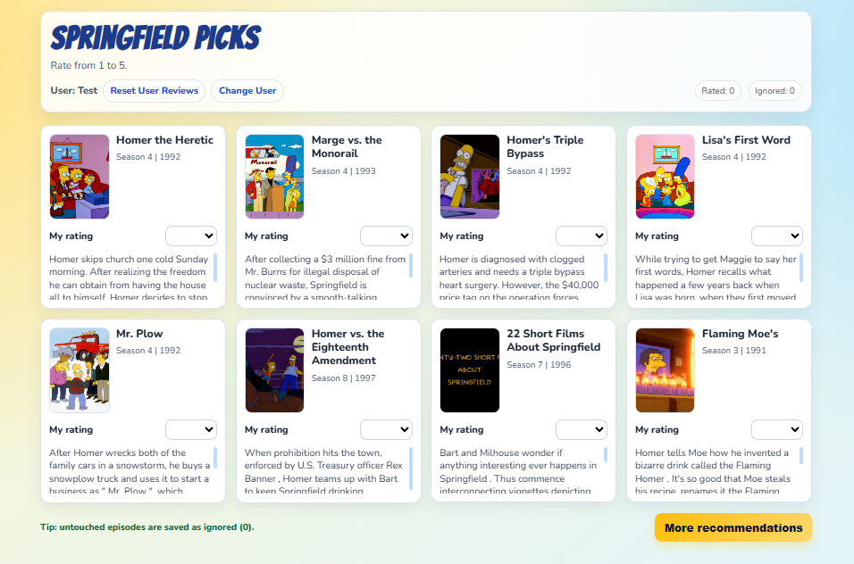

# Simpsons-Episode-Recommender

This repository is for building a Simpsons episode recommender system.

The goal of the project is to create a recommender system for Simpsons episodes, powered by data scraped from internet sources.

The scraping and data-processing layers are the foundation for a later application that will recommend episodes based on user preferences and episode information.

## Project Structure

Current structure:

```text
Simpsons-Episode-Recommender/
├── app/
│   ├── fastapi_app.py
│   ├── recommendation_algorithms.py
│   ├── recommender_db.py
│   ├── templates/
│   │   ├── login.html
│   │   └── recommendations.html
├── scraper/
│   ├── nohomer_scraper.py
│   ├── wikisimpsons_scraper.py
├── etl/
│   ├── build_episodes.py
│   ├── build_reviews.py
│   ├── build_reviewers.py
│   ├── build_database.py
│   ├── run_pipeline.py
├── data/
│   ├── simpsons.db
├── .github/
│   └── workflows/
│       └── ci.yaml
├── tests/
└── README.md
```

Notes:

1. `app/` contains the FastAPI web app, recommendation algorithms, and DB access helpers.
1. `scraper/` collects raw data from NoHomers (reviews) and WikiSimpsons (episode metadata).
2. `etl/` transforms scraped data into datasets and loads them into SQLite.
3. `tests/` contains the automated test suite.

## Scrapers

- **nohomer_scraper.py**: Scrapes NoHomers for user reviews, ratings, and episode review links.
- **wikisimpsons_scraper.py**: Scrapes WikiSimpsons for episode metadata (names, seasons, air dates, writers, showrunners, synopses, images).

Run individual scrapers from the project root:

```bash
python scraper/nohomer_scraper.py
python scraper/wikisimpsons_scraper.py
```

## ETL Pipeline

Transforms scraped data into clean datasets and loads them into a SQLite database:

- `build_episodes.py`: Creates the episodes dataset from WikiSimpsons data.
- `build_reviews.py`: Creates the reviews dataset from NoHomers data.
- `build_reviewers.py`: Creates the reviewers dataset from NoHomers data.
- `build_database.py`: Loads all datasets into a SQLite database.
- `run_pipeline.py`: Orchestrates the full pipeline.

Run the entire pipeline:

```bash
python -m etl.run_pipeline
```

## Web App (FastAPI)

The application layer is implemented in `app/` and is split into:

- `fastapi_app.py`: FastAPI app with endpoints for login, recommendations, reset, and change-user flow.
- `recommender_db.py`: database helper
- `recommendation_algorithms.py`: recommendation algorithms available to use.



### Recommendation Logic

- The app recommends episodes the user has not interacted with yet and returns a small top list.
- By default, recommendations are ordered by strong community ratings; an alternative mode prioritizes frequently well-rated episodes.
- It would be improved..

Run the web app from project root:

```bash
uvicorn app.fastapi_app:app --reload
```

## Current Status

✓ Scrapers: Both NoHomers and WikiSimpsons active

✓ ETL: Full pipeline implemented (episodes, reviews, reviewers)

✓ Database: SQLite loader complete

✓ App: FastAPI web interface with login, recommendations, reset, and change-user flow

Next: Improve recommendation algorithms and model training